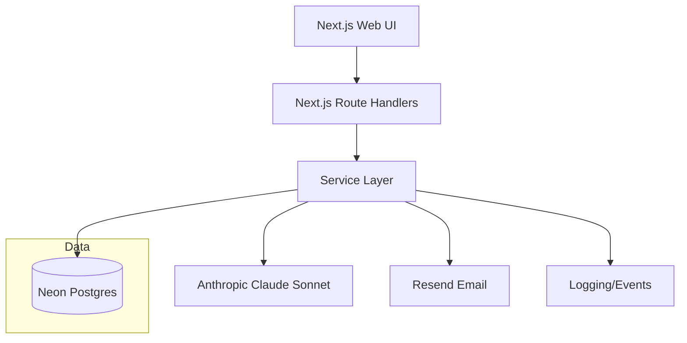

# Technical Design Document: Next Action Decision Assistant MVP

## Executive Summary

**System:** Next Action Decision Assistant  
**Version:** MVP 1.0  
**Architecture Pattern:** Serverless-leaning full-stack Next.js (monolith)  
**Platform:** Responsive web app (desktop + mobile browsers)  
**Timeline:** 1 week  
**Budget:** ~$20/month total (Hosting/DB ~$10 + LLM ~$10)  
**Primary Risks:** LLM latency/quality + user trust + cost control

This document defines **HOW** we’ll build the MVP described in the PRD: a calm, focused web app that recommends a **single next action** from user tasks given context (time/energy/urgency), with explainability and accept/skip feedback.

---

## 1) Key Decisions (with alternatives)

### 1.1 Platform & Framework
**Recommendation:** Next.js (App Router) + TypeScript, deployed on Vercel.

**Alternatives**
- **Remix**
  - Pros: straightforward data loading, great for forms
  - Cons: smaller ecosystem than Next, fewer “default” integrations for Vercel
- **React + Vite**
  - Pros: simple FE, flexible
  - Cons: you must design backend separately (adds time/ops for 1-week MVP)
- **SvelteKit**
  - Pros: fast UI dev, great DX
  - Cons: smaller talent/tooling pool; less “AI-autocomplete familiarity” vs Next

**Trade-off:** Next.js route handlers + server actions are quick for MVP, but encourage a “god app” unless we keep a clean service layer.

### 1.2 Hosting + Database
**Recommendation:** Vercel (web) + Neon Postgres (DB).

**Alternatives**
- **Railway (app + DB)**
  - Pros: simpler single-vendor infra, predictable
  - Cons: slightly less “Next-native” than Vercel for previews; costs may climb earlier
- **Supabase**
  - Pros: integrated auth + Postgres + dashboard; fast CRUD
  - Cons: would replace NextAuth decision; more vendor surface area
- **PlanetScale (MySQL)**
  - Pros: scale-friendly
  - Cons: Prisma + Postgres is already chosen; added friction to switch

**Trade-off:** Neon + Vercel is excellent DX and cost-effective; ensure connection pooling to avoid serverless connection churn.

### 1.3 Auth + Email
**Recommendation:** Auth.js/NextAuth with **Resend** for magic links (and optional OAuth).

**Alternatives**
- **Clerk**
  - Pros: fastest auth UX, great UI components
  - Cons: vendor lock-in + cost; more than needed for 1-week MVP
- **Supabase Auth**
  - Pros: integrated; simple
  - Cons: shifts architecture away from chosen stack (NextAuth)

**Trade-off:** NextAuth is flexible but requires careful configuration and a little more setup time than Clerk.

### 1.4 API / Backend Pattern
**Recommendation:** Next.js Route Handlers (`/app/api/...`) + service layer modules + Zod validation.

**Alternatives**
- **tRPC**
  - Pros: end-to-end types, fast feature dev
  - Cons: extra mental model; may slow you down this week if not already used
- **Separate Fastify/Express service**
  - Pros: clean separation
  - Cons: too much ops/scope for 1-week MVP

**Trade-off:** Route handlers are fast. Maintain discipline: *routing thin, services thick*.

### 1.5 LLM Provider & Integration
**Recommendation:** Anthropic Claude (Sonnet tier) via server-side API calls, with bounded context + caching + quotas.

**Alternatives**
- **OpenAI**
  - Pros: strong function calling, broad ecosystem
  - Cons: different pricing/behavior; you’ve already validated Claude direction
- **Gemini**
  - Pros: large context options
  - Cons: product behavior may differ; no need for huge context if you bound tasks
- **Local model**
  - Pros: cost predictable at scale
  - Cons: too heavy for 1-week MVP; infra complexity

**Trade-off:** LLM calls can be slow/unreliable—must implement graceful degradation to deterministic rules.

---

## 2) Architecture Overview

### 2.1 High-Level Diagram

### 2.2 Key Principles
- **Single-primary-action UX:** always center “Here’s your next step.”
- **Bounded LLM inputs:** top-N tasks only; strict token limits.
- **Never log raw task content:** treat tasks as PII-lite and redact.
- **Cost control by design:** quotas + caching + small prompts.
- **Fail safe:** deterministic recommendation if LLM fails.

---

## 3) Functional Scope Mapping (PRD → Implementation)

| PRD Feature | Implementation Summary |
|---|---|
| Manual tasks/goals CRUD | DB tables + CRUD UI + route handlers |
| Context input (time/energy/urgency) | Context form stored per request + optionally saved to DB |
| Single next action recommendation | Hybrid pipeline: rules shortlist → LLM choose + explain |
| Brief explanation | LLM output field; also allow rule-based explanation fallback |
| Accept/skip feedback | Store events; influence shortlist ordering + future prompts |
| History (should-have) | “Recent recommendations” page/section based on events table |

---

## 4) Data Model (Postgres + Prisma)

### 4.1 Entities

**User**
- `id` (uuid)
- `email`
- `createdAt`

**Goal**
- `id`, `userId`
- `title`
- `description?`
- `isActive`
- `createdAt`, `updatedAt`

**Task**
- `id`, `userId`, `goalId?`
- `title`
- `notes?`
- `status` (enum: `todo`, `done`, `archived`)
- `priority` (int 1–5, optional)
- `urgency` (int 1–5, optional)
- `estimatedMinutes` (int, optional)
- `deadlineAt?` (timestamp)
- `lastTouchedAt` (timestamp; updated on edits)
- `createdAt`, `updatedAt`

**RecommendationEvent**
- `id`, `userId`
- `taskId`
- `contextTimeMinutes` (int)
- `contextEnergy` (enum: `low`, `med`, `high`)
- `contextUrgency` (enum: `low`, `med`, `high`)
- `mode` (enum: `default`, `quickWin`, `deepWork`) *(future; default `default`)*
- `decision` (enum: `recommended`, `accepted`, `skipped`)
- `confidence` (enum: `low`, `med`, `high`)
- `explanation` (text; **do not log elsewhere**)
- `model` (text; e.g., `claude-sonnet` or `rules`)
- `createdAt`

**LLMBudget**
- `userId`
- `day` (date)
- `count` (int)

### 4.2 Prisma Schema Notes
- Add indexes:
  - `Task(userId, status)`
  - `Task(userId, deadlineAt)`
  - `Task(userId, lastTouchedAt)`
  - `RecommendationEvent(userId, createdAt)`
  - `LLMBudget(userId, day)`

---

## 5) API Design (Route Handlers)

All endpoints require auth.

### 5.1 Tasks
- `GET /api/tasks` (list; filters: status, goalId)
- `POST /api/tasks` (create)
- `PUT /api/tasks/:id` (update)
- `DELETE /api/tasks/:id` (soft delete → `archived` recommended)

### 5.2 Goals
- `GET /api/goals`
- `POST /api/goals`
- `PUT /api/goals/:id`
- `DELETE /api/goals/:id` (archive)

### 5.3 Recommendations
- `POST /api/recommendations`
  - Body: `{ timeMinutes, energy, urgency, mode?, goalId? }`
  - Returns: `{ recommendedTaskId, recommendedNextActionText, explanation, confidence, source }`
- `POST /api/recommendations/:id/accept`
- `POST /api/recommendations/:id/skip`

### 5.4 Validation
- Use **Zod** schemas at each handler boundary.
- Never trust client-provided `userId`.

---

## 6) Recommendation Engine Design (Hybrid)

### 6.1 Overview

Pipeline (per request):
1. Fetch candidate tasks (status=todo, optional goal scope)
2. Rules-based scoring → shortlist (top N = 20–40)
3. LLM selects + produces next action + explanation (bounded tokens)
4. Persist `RecommendationEvent` (`recommended`)
5. UI renders rec + accept/skip actions
6. On accept/skip, persist follow-up event

### 6.2 Rules Scoring (Deterministic)
Score tasks using weighted features (simple, interpretable):
- Deadline proximity
- Priority/urgency
- Fit-to-time (estimatedMinutes <= time available)
- Fit-to-energy (energy → size proxy)
- Recency adjustments
- Skip-penalty (mild) for repeatedly skipped tasks

**Output:** ranked list + a short rule-based explanation string for fallback.

### 6.3 LLM Prompting (Bounded)
**Inputs (per your spec):**
- Top N tasks (20–40): compact fields; truncate notes
- Goals: top 3–5 or selected goal
- Recent accepts/skips: last 5–10 events
- Context: time/energy/urgency (+ optional mood/focus)

**Hard limits:**
- Input budget: ~4k tokens (truncate/summarize)
- Output budget: ~300 tokens

**Output (structured JSON):**
- `recommendedTaskId`
- `recommendedNextActionText`
- `explanation` (1–3 sentences)
- `confidence` (Low/Med/High)

### 6.4 Parsing & Retries
- Validate JSON with Zod.
- If invalid: retry once with “repair JSON” prompt.
- If still invalid: fallback to rules pick.

### 6.5 Failure / Degradation
If LLM errors or times out:
- Use deterministic rules pick.
- Message: “AI is unavailable — here’s the best next task based on deadlines/priority/time.”
- Offer Retry button.

### 6.6 Caching (MVP)
Cache recommendation results for 2–5 minutes to save cost:
- Cache key: `userId + context + shortlistHash + recentEventsHash`
- **Option A (recommended for 1-week):** Postgres `RecommendationCache` table
- Option B: Upstash Redis (extra service)
- Option C: in-memory (unreliable in serverless)

---

## 7) Quotas, Rate Limiting, and Cost Controls

### 7.1 Daily LLM Cap
- **10 recommendations/day/user**
- Store/increment in `LLMBudget`
- If exceeded: return deterministic recommendation + “daily AI limit reached” notice

### 7.2 Rate Limiting (Recommendation endpoint)
Start simple for MVP:
- Enforce request spacing (e.g., reject if last request < 3s ago)
- If abuse appears: add Upstash rate limit

### 7.3 Prompt Efficiency Rules
- Send only compact task fields
- Truncate notes
- Never send full “all tasks” if user has many; always top-N

---

## 8) UI/UX Implementation

### 8.1 Key Screens
1. Dashboard (context form + recommendation card)
2. Tasks (list + add/edit)
3. Goals (list + filter)
4. History (recent recommendations/outcomes)
5. Auth pages

### 8.2 Component Strategy
- `components/ui/*` (shadcn)
- `components/features/*`: `ContextForm`, `RecommendationCard`, `TaskForm`, `HistoryList`

### 8.3 Interaction Rules
- Primary CTA always visible
- Accept/skip is one click
- After accept/skip: show “Get next recommendation” immediately

---

## 9) Logging, Analytics, and PII-lite Handling

### 9.1 Events (DB + minimal logs)
Track:
- `create_task`, `request_recommendation`, `recommendation_shown`, `accepted`, `skipped`

### 9.2 PII-lite Handling
- Do not log raw task titles/notes in app logs.
- For debugging: log IDs and derived features only.

---

## 10) Testing Plan (1-week appropriate)

### 10.1 E2E (Playwright)
Protect the core loop:
- Create task → request rec → accept/skip → next rec

### 10.2 Manual QA
- Mobile Safari smoke test
- Slow LLM simulation: loading + retry
- AI cap reached: deterministic path message

---

## 11) Deployment Plan

### 11.1 Environments
- Local + Production only

### 11.2 Vercel Setup
Env vars:
- `DATABASE_URL`
- `NEXTAUTH_SECRET`
- `NEXTAUTH_URL`
- `RESEND_API_KEY`
- `ANTHROPIC_API_KEY`

### 11.3 Prisma Migrations
- Run `prisma migrate deploy` on production deploy (manual step for MVP is OK)

---

## 12) Cost Model (Back-of-the-envelope)

Week-1 expected LLM calls/day: **50–200** total (bounded by per-user caps).  
Primary cost levers: cache TTL, top-N, note truncation, daily caps.

---

## 13) 1-Week Implementation Plan

**Day 1–2: Foundation**
- Scaffold + UI kit + auth
- DB schema + CRUD for tasks/goals

**Day 3–4: Deterministic Recommendation**
- Rules scoring + recommendation endpoint
- Recommendation UI + accept/skip events + history

**Day 5: LLM Integration**
- Bounded prompt + JSON parsing
- Retry + fallback + caching + quotas

**Day 6: Testing + Polish**
- Playwright core flow
- Loading/error states, copy tone

**Day 7: Launch**
- Mobile Safari + desktop smoke
- Invite early adopters, collect feedback

---

## 14) Open Questions / Assumptions
- Persist context defaults per user vs request-scoped only?
- How strong should skip-penalty be initially? (start mild)
- Do we store “nextActionText” per task, or only per recommendation event? (recommendation event is sufficient for MVP)

---

## Step 1: Verification Echo (Required)

Let me confirm I understand your technical requirements:

Project: Next Action Decision Assistant (from PRD)  
Platform: Web (responsive desktop + mobile browsers)  
Tech Approach: Full-code, serverless-leaning monolithic Next.js app

Key Technical Decisions:
- Frontend: Next.js (App Router) + TypeScript + Tailwind + shadcn/ui
- Backend: Next.js route handlers + service layer
- Database: Neon Postgres + Prisma
- Auth: NextAuth/Auth.js + Resend (magic links)
- Analytics: DB + logs (no raw task content in logs)
- LLM: Anthropic Claude Sonnet with bounded context (~4k input tokens), caching, daily caps (10/day), and fallback to deterministic rules

Budget: ~$20/month total  
Timeline: 1 week  
Main Concern: LLM latency/quality + cost control + trust (with safe fallback)

Is this correct? Any adjustments before you start implementation?

---
*Document created: Feb 10, 2026*  
*Status: Draft — Ready for implementation*
